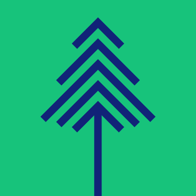
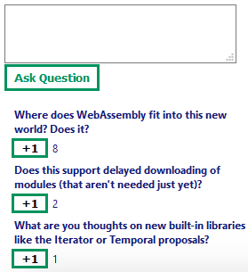

![Built With Stencil](https://img.shields.io/badge/-Built%20With%20Stencil-16161d.svg?logo=data%3Aimage%2Fsvg%2Bxml%3Bbase64%2CPD94bWwgdmVyc2lvbj0iMS4wIiBlbmNvZGluZz0idXRmLTgiPz4KPCEtLSBHZW5lcmF0b3I6IEFkb2JlIElsbHVzdHJhdG9yIDE5LjIuMSwgU1ZHIEV4cG9ydCBQbHVnLUluIC4gU1ZHIFZlcnNpb246IDYuMDAgQnVpbGQgMCkgIC0tPgo8c3ZnIHZlcnNpb249IjEuMSIgaWQ9IkxheWVyXzEiIHhtbG5zPSJodHRwOi8vd3d3LnczLm9yZy8yMDAwL3N2ZyIgeG1sbnM6eGxpbms9Imh0dHA6Ly93d3cudzMub3JnLzE5OTkveGxpbmsiIHg9IjBweCIgeT0iMHB4IgoJIHZpZXdCb3g9IjAgMCA1MTIgNTEyIiBzdHlsZT0iZW5hYmxlLWJhY2tncm91bmQ6bmV3IDAgMCA1MTIgNTEyOyIgeG1sOnNwYWNlPSJwcmVzZXJ2ZSI%2BCjxzdHlsZSB0eXBlPSJ0ZXh0L2NzcyI%2BCgkuc3Qwe2ZpbGw6I0ZGRkZGRjt9Cjwvc3R5bGU%2BCjxwYXRoIGNsYXNzPSJzdDAiIGQ9Ik00MjQuNywzNzMuOWMwLDM3LjYtNTUuMSw2OC42LTkyLjcsNjguNkgxODAuNGMtMzcuOSwwLTkyLjctMzAuNy05Mi43LTY4LjZ2LTMuNmgzMzYuOVYzNzMuOXoiLz4KPHBhdGggY2xhc3M9InN0MCIgZD0iTTQyNC43LDI5Mi4xSDE4MC40Yy0zNy42LDAtOTIuNy0zMS05Mi43LTY4LjZ2LTMuNkgzMzJjMzcuNiwwLDkyLjcsMzEsOTIuNyw2OC42VjI5Mi4xeiIvPgo8cGF0aCBjbGFzcz0ic3QwIiBkPSJNNDI0LjcsMTQxLjdIODcuN3YtMy42YzAtMzcuNiw1NC44LTY4LjYsOTIuNy02OC42SDMzMmMzNy45LDAsOTIuNywzMC43LDkyLjcsNjguNlYxNDEuN3oiLz4KPC9zdmc%2BCg%3D%3D&colorA=16161d&style=flat-square)  
[](http://commitizen.github.io/cz-cli/)

<p align="center" >
  
</p>

# Q&A Component

A web component to manage audience questions during a live streamed event. Originally used at CascadiaJS 2020.

<p align="center" >
  
</p>

## Getting Started

To use the component in one of your projects, include a `script` tag in the `<head>` of your `index.html` file.

```html
<script type="module">
  import { defineCustomElements } from 'https://cdn.jsdelivr.net/npm/@cascadiajs/q-and-a/loader/index.es2017.js';
  defineCustomElements();
</script>
```

If your application does not support modules or you want to add a fallback for older browsers include this script.

```html
<script nomodule src="https://unpkg.com/@cascadiajs/q-and-a/dist/q-and-a/q-and-a.js"></script>
```

Then you can use the element anywhere in your template, JSX, html etc.

```html
<q-and-a user-id="my-user" correlation-id="my-id"></q-and-a>
```

## Using the Component

Please see the documentation regarding how to configure the component [here](src/components/q-and-a/readme.md).

The component does a great job submitting and fetching questions from the audience at a configurable interval, but it is up to you to implement the logic in the backend so all users are seeing the same content during your session. For an example project implementation of a backend using [Begin](begin.com), please see [this repo](https://github.com/bniedermeyer/q-and-a-demo).

### Submitting a question

When a user submits a question, the component will post the following object to the configured endpoint.

```js
{
  /**
   * The question the user asked
   */
  "question": "What skills do I need to focus on to be a good mentor?",
  /**
   * Optional user identifier, if configured for the component
   */
  "userId": "user-1",
  /**
   * Optional correlation id, if configured for the component
   */
  "correlationId": "keynote-talk"
}
```

### Fetching questions that have been asked

The component will fetch a list of questions asked from the backend at a configurable interval of time. These questions can look like the question above, but should also include two additional manditory fields.

```js
[
  {
    /**
     * The question the user asked. Must be present on all questions retrieved from the server.
     */
    "question": "What kind of problem is your favorite to solve?",
    /**
     * Unique question identifier. Must be present on all questions retrieved from the server.
     */
    "key": "question2",
    /**
     * Count of times the question has been asked and upvoted by the other users. Must be present on all questions retrieved from the server
     */
    "count": "4",
    /**
     * Optional user identifier, if configured for the component
     */
    "userId": "user-4",
    /**
     * Optional correlation id, if configured for the component
     */
    "correlationId": "keynote-talk"
  },
];
```

### Incrementing a questions count

When a user clicks on a `+1` button for a question, they are saying "I also want to know the answer to this question". These +1s are posted to the backend with the following shape. The `userId` is an optional field that will be sent if it is configured for the component. This way you can prevent users from spamming the +1s on a question, or see who all voted for the question.

```js
{
  "key": "question1",
  "userId": "user-4"
}
````

## Development

### Stencil

This component was built with Stencil.

Stencil is a compiler for building fast web apps using Web Components.

Stencil combines the best concepts of the most popular frontend frameworks into a compile-time rather than run-time tool. Stencil takes TypeScript, JSX, a tiny virtual DOM layer, efficient one-way data binding, an asynchronous rendering pipeline (similar to React Fiber), and lazy-loading out of the box, and generates 100% standards-based Web Components that run in any browser supporting the Custom Elements v1 spec.

Stencil components are just Web Components, so they work in any major framework or with no framework at all.

### Getting Started

```bash
npm ci
npm start
```

To build the component for production, run:

```bash
npm run build
```

To run the unit tests for the components, run:

```bash
npm test
```

Need help? Check out our docs [here](https://stenciljs.com/docs/my-first-component).

### Contributing

[Code of Conduct](https://2020.cascadiajs.com/coc)

We love contributions! Please be sure to read [CONTRIBUTING.md](CONTRIBUTING.md) prior to opening any pull requests or creating issues.
