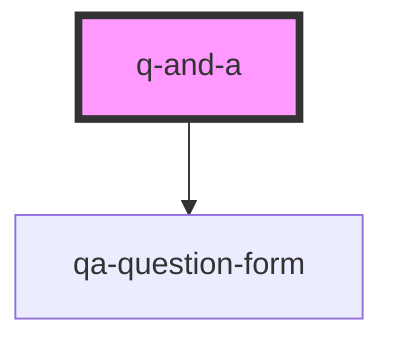

# q-and-a

Please note that while the component does a great job submitting and fetching questions from the audience, it is up to you to implement the logic in the backend. The properties, and the options they configure, are useful for configuring the behavior of the component and what information it sends to your backend.

<!-- Auto Generated Below -->

## Properties

| Property           | Attribute           | Description                                                                                                                                                                                                                                                                                                                                              | Type     | Default     |
| ------------------ | ------------------- | -------------------------------------------------------------------------------------------------------------------------------------------------------------------------------------------------------------------------------------------------------------------------------------------------------------------------------------------------------- | -------- | ----------- |
| `askEndpoint`      | `ask-endpoint`      | The endpoint that questions/upvotes will be posted to. Defaults to `/ask` if not defined                                                                                                                                                                                                                                                                 | `string` | `undefined` |
| `correlationId`    | `correlation-id`    | The correlation id of the q-and-a session. If present, will be sent with questions and used to retrieve questions by appending a `correlationId` query parameter to the `retrieveEndpoint` url. A good use case for this property is to track which talk is being given at a time. This way you can only display questions relevant to the current talk. | `string` | `undefined` |
| `pollingInterval`  | `polling-interval`  | The interval in which the questions should be fetched in ms. Defaults to 10000ms (10 seconds).                                                                                                                                                                                                                                                           | `number` | `10000`     |
| `primaryColor`     | `primary-color`     | Primary color. Used mainly for button borders. Defaults to #10915b                                                                                                                                                                                                                                                                                       | `string` | `undefined` |
| `retrieveEndpoint` | `retrieve-endpoint` | The endpoint the list of questions will be retrieved from. Defaults to `/questions` if not defined                                                                                                                                                                                                                                                       | `string` | `undefined` |
| `secondaryColor`   | `secondary-color`   | Secondary color. Used for question and header text color. Defaults to #112378                                                                                                                                                                                                                                                                            | `string` | `undefined` |
| `userId`           | `user-id`           | The optional id of the user asking a question. Will be sent with the question if present.                                                                                                                                                                                                                                                                | `string` | `undefined` |

## Dependencies

### Depends on

- [qa-question-form](../qa-question-form)

### Graph

---

_Built with [StencilJS](https://stenciljs.com/)_
