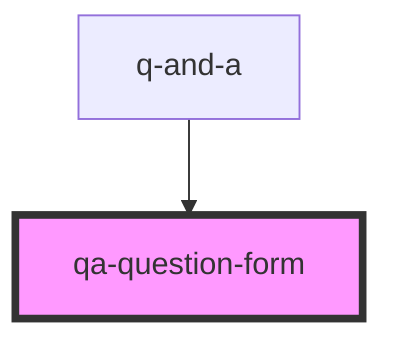

# qa-question-form

<!-- Auto Generated Below -->

## Shadow Parts

| Part                     | Description |
| ------------------------ | ----------- |
| `"confirmation-message"` |             |
| `"error-message"`        |             |
| `"form"`                 |             |
| `"loading-message"`      |             |
| `"question-textarea"`    |             |
| `"submit-button"`        |             |

## Dependencies

### Used by

 - [q-and-a](../q-and-a)

### Graph

----------------------------------------------

*Built with [StencilJS](https://stenciljs.com/)*
